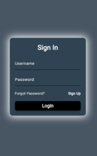
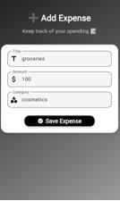
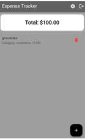
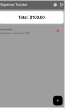
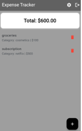
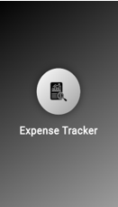

# 💰 Expense Tracker App

A cross-platform **Expense Tracker Application** built with **Flutter and Firebase** that helps users manage their daily expenses, track spending, and maintain financial records with a simple and intuitive interface.

The app includes Firebase authentication, expense management, dashboard analytics, and local data storage using Shared Preferences for a smooth user experience.

---

## 📱 App Screenshots

### Splash Screen

### Login Screen

### Forgot Password

### Expense Dashboard

### Add Expense Screen

### Settings Screen

---

## ✨ Features

- 🚀 Splash Screen
  - User Login
  - Forgot Password
- 💰 Add and Manage Expenses
- 📊 Expense Dashboard
- 📈 Track Total Spending and Transactions
- ⚙️ Settings Management
- 💾 Local Storage using Shared Preferences
- 🎨 Clean and Responsive Flutter UI

---

## 🛠️ Technologies Used

### Frontend
- Flutter
- Dart

### Local Storage
- Shared Preferences

### Tools
- Android Studio
- Visual Studio Code
- Git & GitHub

